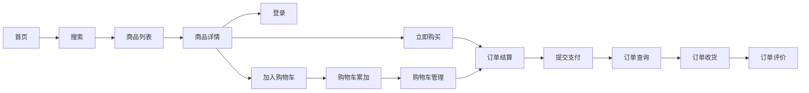

# 移动端电商购物项目（learning）
一个完整的移动端电商购物应用，实现了从商品浏览到订单评价的全流程购物体验。

## ✨ 核心功能模块


### 功能流程
1.  **首页浏览**：展示商品推荐与分类入口
2.  **搜索与列表**：关键词搜索、商品筛选与列表展示
3.  **商品详情**：查看商品信息、规格与评价
4.  **用户登录**：账号验证与身份识别
5.  **购物车操作**：商品加入、数量累加与管理
6.  **订单结算**：确认商品、地址与金额
7.  **支付流程**：提交支付与状态反馈
8.  **订单管理**：订单查询、收货确认与评价

## 🛠️ 技术栈与工程能力
- **核心框架**：Vue + Vuex + Vue Router
- **UI 组件库**：Vant（支持全部导入与按需导入）
- **样式适配**：vw 移动端自适应布局
- **网络请求**：Axios + 请求/响应拦截器
- **数据存储**：本地存储模块封装
- **工程化**：
  - 路由配置：嵌套路由 + 导航守卫 + 路由跳转传参
  - 状态管理：Vuex 分模块管理全局数据
  - API 封装：统一请求方法与接口模块
  - 构建优化：项目打包与性能优化

## 🎯 项目收获
- 掌握**完整电商购物业务流程**开发，理解从商品到订单的全链路逻辑
- 熟练使用 **Vant 组件库** 开发移动端界面，实现按需加载优化
- 实现 **vw 布局适配**，保证多端设备视觉一致性
- 封装 **request、storage、api** 模块，提升代码复用性与可维护性
- 实践 **请求/响应拦截器**，统一处理 token、错误码等逻辑
- 掌握 **嵌套路由、导航守卫、路由传参** 等高级路由用法
- 学会 **Vuex 分模块管理** 复杂全局状态
- 完成项目**打包与性能优化**，适配生产环境部署

---

## 🚀 快速开始
```bash
# 安装依赖
npm install

# 启动开发服务
npm run serve

# 生产环境打包
npm run build
```
## 注意
仅为VUE2学习项目
---
